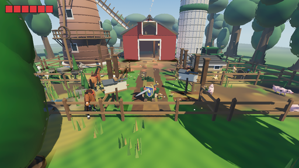
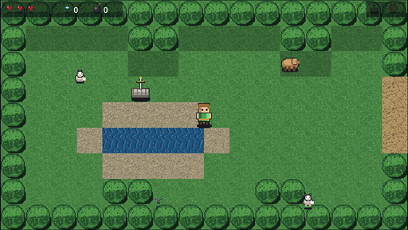
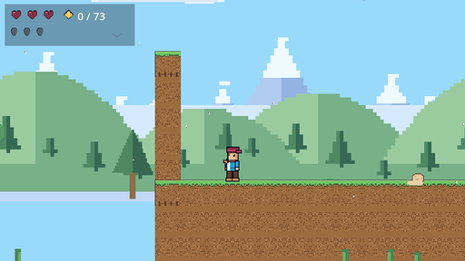
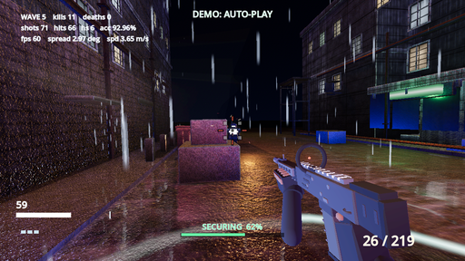
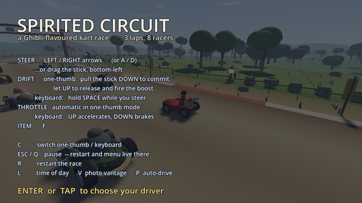
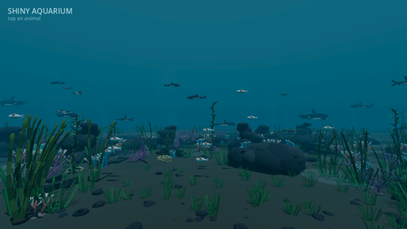

<div align="center">

# Shiny Gen

### Make Godot games with AI, in your browser

Describe a game, play it, share it. Shiny Gen makes **real games on the Godot engine**, right in your
browser. The AI writes the code and creates the art, so there's no engine to learn and nothing to install.

[**▶ Play now**](https://shinygen.ai/play) · [Docs](docs/) · [FAQ](docs/faq.md) · [npm](https://www.npmjs.com/package/shinygen) · [MCP](docs/mcp.md)

`AI Creation` · `WebGPU Native` · `Plays in Your Browser`

</div>

---

This repository is the **public documentation** for Shiny Gen. The canonical, always-current version
of every page lives at [shinygen.ai](https://shinygen.ai) — each doc here links to its source.

## Start in 60 seconds

**Making a game?** Go to [shinygen.ai/play](https://shinygen.ai/play), create a free account, and
describe what you want. The AI writes GDScript and the game runs as it's written. Nothing to install,
and new accounts include free gems for AI generation.

**Embedding a game on your own site?** One script tag boots the engine on your canvas:

```html
<!doctype html>
<canvas id="canvas"></canvas>

<script src="https://cdn.jsdelivr.net/npm/shinygen@4.6.0-rc.14/shinygen.js"></script>
<script type="text/gdscript" name="Main">
extends Node3D

var cube: MeshInstance3D

func _ready():
    var camera = Camera3D.new()
    camera.transform.origin = Vector3(0.0, 2.0, 4.5)
    camera.look_at(Vector3(0.0, 0.8, 0.0))
    add_child(camera)

    var light = DirectionalLight3D.new()
    light.light_energy = 1.5
    light.rotation_degrees = Vector3(-40.0, -30.0, 0.0)
    add_child(light)

    cube = MeshInstance3D.new()
    var box = BoxMesh.new()
    box.size = Vector3(2.0, 2.0, 2.0)
    cube.mesh = box
    cube.transform.origin = Vector3(0.0, 1.0, 0.0)

    var mat = StandardMaterial3D.new()
    mat.albedo_color = Color(0.9, 0.15, 0.1)
    mat.metallic = 0.25
    mat.roughness = 0.35
    cube.set_surface_override_material(0, mat)
    add_child(cube)

func _process(delta):
    cube.rotation.y += delta * 1.2
    cube.rotation.x += delta * 0.5
</script>
<script>
  ShinyGen.start({ canvas: "#canvas" });
</script>
```

That's a red cube spinning under a directional light — a complete, running Shiny Gen scene.
See [Embed games on your website](docs/embed.md).

## How it works

1. **Describe a game.** Type what you want in plain language: a genre, a scene, a mechanic, or a whole idea.
2. **The AI writes real game code.** Shiny Gen generates GDScript (the Godot engine's scripting language) and runs it immediately on the engine in your browser.
3. **Play it instantly.** The game runs as it is built. There is nothing to install and no engine to learn.
4. **Edit anything with the built-in editors.** Four AI creation surfaces: a game-code editor (GDScript), a 3D model editor, an image editor, and audio generation for sound effects and music.
5. **Share it.** Every game can be shared with a link, downloaded as a single HTML file, or embedded on any website with the `shinygen` npm package.

Full walkthrough: [Getting started](docs/getting-started.md).

## What makes it different

**It's browser-native *and* a real game engine.** Most AI game tools are one or the other.
Prompt-to-game websites are instant but keep your game inside their own runtime. Engine-based AI tools
produce a real project but run as desktop software. Shiny Gen is both at once: it runs entirely in the
browser, and what it builds is a real Godot project written in GDScript that you own.

**It's a whole game engine, not just a renderer.** Web games built with Three.js get a 3D renderer, and
everything else is hand-written: physics, input, scenes, cameras, tooling. Shiny Gen puts the Godot
engine itself in the browser — physics, scenes, input, audio, and editors included — running on a WebGPU
renderer compiled to WebAssembly.

**Its MCP server is hosted, not a desktop bridge.** Connect Claude, ChatGPT, or any MCP client, and the
assistant can read your project, write code, generate assets, and run the game, live, in your browser.
Other game-engine MCP integrations bridge to a desktop editor on your machine; Shiny Gen's is hosted,
with nothing to install.

**Games live on the web.** A Shiny Gen game is a link anyone can open. It can also be downloaded as a
single HTML file with its engine version pinned, so it keeps working identically forever.

## Examples

Click any example to play it, then remix it with AI.

|  |  |  |
|:--:|:--:|:--:|
| [<br>**Hollow Farm**](https://shinygen.ai/gen/Hollow_Farm) | [<br>**Shiny 2D Adventure**](https://shinygen.ai/gen/Shiny_2D_Adventure) | [<br>**Shiny Platformer**](https://shinygen.ai/gen/Shiny_Platformer) |
| [<br>**Nightfall Protocol**](https://shinygen.ai/gen/Nightfall_Protocol) | [<br>**Spirited Circuit**](https://shinygen.ai/gen/Spirited_Circuit) | [<br>**Shiny Aquarium**](https://shinygen.ai/gen/Shiny_Aquarium) |
| [<br>**Reef**](https://shinygen.ai/gen/fable-reef) | [<br>**Black Hole**](https://shinygen.ai/gen/black-hole) | [<br>**Murmuration**](https://shinygen.ai/gen/boids-murmuration) |

**[→ All 70 examples](docs/examples.md)**

## Embed games on your website

A Shiny Gen game runs natively on any web page — your portfolio, blog, or game site. It is **not an
iframe**: the engine boots on your canvas, WebGPU-rendered by default with a WebGL2 fallback for
browsers without WebGPU.

The easy way is to open the **Share** menu in Shiny Gen and choose **Download as HTML** — you get a
single file with the engine reference already wired in, pinned to an exact version. For full control,
use the script tag above, or `npm install shinygen`.

See [Embed games on your website](docs/embed.md).

## Connect Claude or ChatGPT

Shiny Gen ships a hosted MCP server at `https://mcp.shinygen.ai/mcp`. Connect an AI assistant and it can
build, edit, and play-test your project, live in your browser. There is nothing to install.

```
claude mcp add --transport http shinygen https://mcp.shinygen.ai/mcp
```

For Claude web/desktop, ChatGPT, or any other MCP client, add that same URL wherever your client
configures connectors. Authorization uses OAuth with three scoped permissions:

| Scope | What it allows |
|---|---|
| `projects.read` | See your project: what is on screen, the focused document, and its current state. |
| `projects.write` | Write and edit game code and asset documents. Code edits are free. |
| `assets.generate` | Run AI generation (images, 3D models, audio). Spends gems, with a daily gem cap. |

Writing code is always free; only generation spends gems. On the free tier, your first connection
starts a 30-day full-connector trial, after which a weekly allowance limits how many actions an
assistant can take — reading is never limited, and paid members are not subject to it.

**Prefer not to wire up a connector?** Shiny Gen has its own AI agent built into the app, with the same
abilities — reading your project, writing game code, generating assets, and play-testing what it builds.

See [Connect Claude or ChatGPT](docs/mcp.md).

## Gems and pricing

Shiny Gen is **free to use**, and no subscription is required. Building, playing, and sharing games
costs nothing; AI generation spends gem credits.

- **Free:** making games (including all code editing), playing, sharing links, HTML download, importing your own images.
- **Uses gems:** AI generation only — images, sprite animations, 3D models, sound effects, and music. Each generation shows its cost before you run it.
- **Free gems:** new accounts start with them.
- **Buying:** one-time gem packs that never expire, or an optional membership that adds monthly gems.

See [Gems and pricing](docs/gems-and-pricing.md).

## Specifications

| | |
|---|---|
| **Product** | Shiny Gen: AI game maker |
| **Engine** | Godot (customized fork with a WebGPU renderer, compiled to WebAssembly) |
| **Game code** | GDScript (runs in a sandboxed subset for security) |
| **Runs on** | Any modern web browser; iOS and Android apps coming soon |
| **Pricing** | Free to use; gem credits for AI generation only. No subscription required |
| **Built-in editors** | Game code (GDScript) · 3D models · Images · Audio & music |
| **AI generation** | Game code, images, sprite animations, 3D models, sound effects, and music, using leading models including Claude and Gemini |
| **Sharing & export** | Share links · single-file HTML download · `shinygen` npm embed |
| **MCP** | Hosted server at `mcp.shinygen.ai`; works with Claude, ChatGPT, and any MCP client |
| **Company** | Shiny AI Technologies, LLC (Massachusetts, USA), founded 2024 |
| **Contact** | hello@shinygen.ai |

## Documentation

| Guide | What it covers |
|---|---|
| [What is Shiny Gen](docs/what-is-shiny-gen.md) | How it works, what makes it different, full specifications |
| [Getting started](docs/getting-started.md) | From nothing to a shared game |
| [FAQ](docs/faq.md) | Pricing, Godot, platforms, ownership, export, MCP |
| [Connect Claude or ChatGPT](docs/mcp.md) | The hosted MCP server, scopes, and what an assistant can do |
| [Gems and pricing](docs/gems-and-pricing.md) | What's free, what uses gems, how buying works |
| [Embed games on your website](docs/embed.md) | The `shinygen` npm package |
| [Examples](docs/examples.md) | All 70 playable examples |
| [GDScript API reference](docs/gdscript-api-reference.md) | The exact supported API surface for game code |
| [Support](docs/support.md) | Contact, requirements, bug reports |

## What Shiny Gen is not

- **Not a hosted prototype box** — your game is a real Godot project you own, not a clip locked to one page.
- **Not just a 3D renderer** like Three.js — it's a whole game engine, so you don't hand-code physics, scenes, or tooling.
- **Not a desktop download** — it runs in the browser, with iOS and Android apps coming soon.
- **Not a Godot plugin** — it's a standalone product built on Godot; you never install Godot.
- **Not related to [Shiny](https://shiny.posit.co/)**, the R/Python web framework by Posit.
- **Not related to** Pokémon shiny hunting.

## Legal

[Terms of Service](https://shinygen.ai/terms-of-service) ·
[Privacy Policy](https://shinygen.ai/privacy-policy) ·
[Payment Terms](https://shinygen.ai/payment-terms) ·
[Cookies Policy](https://shinygen.ai/cookies-policy) ·
[EULA](https://shinygen.ai/eula) ·
[Support](https://shinygen.ai/support)

You own the games and assets you create with Shiny Gen, and you can use them commercially.

The documentation in this repository is licensed [CC BY 4.0](LICENSE). The Shiny Gen Engine itself
(the `shinygen` npm package) is proprietary and governed by [its own license](LICENSE-ENGINE.txt) —
free to use, including commercially, to make games.

---

<div align="center">

**[shinygen.ai](https://shinygen.ai)** · © 2026 Shiny AI Technologies, LLC

</div>
