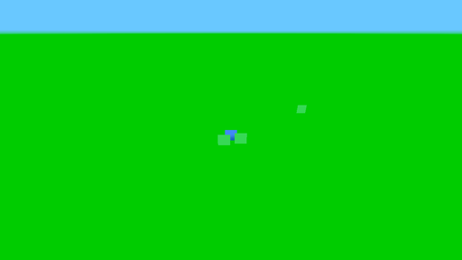
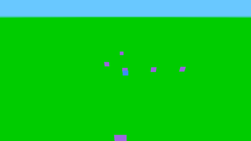

# Examples

> Canonical version: **<https://shinygen.ai>**

Click any example to play it, then remix it with AI. Every one of these is a real Shiny Gen
project running on the Godot engine in your browser.

**70 examples.**

| | Example | What it is |
|---|---|---|
|  | **[Reef](https://shinygen.ai/gen/fable-reef)** `3D` · `Simulation` | A living procedural reef where neon fish shoals flock under god-rays past drifting jellyfish, coral and swaying seagrass. |
|  | **[Stillwater](https://shinygen.ai/gen/fable-koi-pond)** `3D` · `Simulation` | A serene overhead koi pond where segmented koi bend into S-curves around lily pads and drifting petals. |
|  | **[Tidepool](https://shinygen.ai/gen/fable-tidepool)** `3D` · `Simulation` | A living ecosystem of glowing plankton, orange grazers and purple hunters, as energy flows and the cycles turn. |
|  | **[Black Hole](https://shinygen.ai/gen/black-hole)** `Shader` · `Raymarch` | Raymarched gravitational lensing: blazing photon ring, Doppler-beamed accretion disk, warped starfield. |
|  | **[Spiral Galaxy](https://shinygen.ai/gen/galaxy-spiral)** `3D` · `60k instances` | 60,000 stars in one draw call: log-spiral arms, amber core, HII regions, halo, and a cinematic camera sweep. |
|  | **[Infinite Ocean](https://shinygen.ai/gen/infinite-ocean)** `Shader` · `3D` | Seascape-class water: 5 Gerstner octaves displacing 48k verts, fresnel sky, sun-glitter path, crest foam. |
|  | **[Raymarched Temple](https://shinygen.ai/gen/raymarch-temple)** `Raymarch` | A desert temple that lives entirely in one fragment shader: SDF columns, soft shadows, 5-tap AO, haze. |
|  | **[Nebula Flight](https://shinygen.ai/gen/nebula-flight)** `Volumetric` | An endless flight through volumetric FBM gas clouds, with teal, magenta and amber wisps over a starfield. |
|  | **[Murmuration](https://shinygen.ai/gen/boids-murmuration)** `Simulation` · `Boids` | 900 starlings flock at 60fps: emergent waves, a wandering attractor, and a falcon that scatters them. |
|  | **[Battle Simulator](https://shinygen.ai/gen/battle-sim)** `Simulation` · `Battle` | 520 soldiers clash on a misty field: charges, shoving fronts, arrow volleys, banners, endless rematches. |
|  | **[Ecosystem](https://shinygen.ai/gen/ecosystem)** `Simulation` | Predator-prey dynamics live: rabbits graze and breed, foxes hunt, grass regrows. Boom, crash, recover. |
|  | **[City Traffic](https://shinygen.ai/gen/city-traffic)** `3D` · `Simulation` | A neon metropolis at night: glowing window grids, rooftop signs, and rivers of head/taillights below. |
|  | **[Fireflies Forest](https://shinygen.ai/gen/fireflies-forest)** `3D` · `Particles` | A moonlit clearing where 240 fireflies pulse with individual rhythms among misty pines. |
|  | **[Ocean Reef](https://shinygen.ai/gen/kelp-reef)** `3D` · `Shader` | A full ocean ecosystem: whale, sharks, turtle, manta, jellyfish, squid, octopus, eel + 4 fish schools over swaying kelp and caustics. |
|  | **[Rainforest](https://shinygen.ai/gen/rainforest)** `3D` · `Ecosystem` | A living jungle: waterfall + stream, macaws, toucan, monkey on a vine, jaguar, sloth, heron, capybara, frogs, leafcutter ants and more. |
|  | **[Rain Street](https://shinygen.ai/gen/rain-street)** `3D` · `Atmosphere` | Neon noir alley: streaking rain, wet-asphalt sign reflections, a flickering tube, distant lightning. |
|  | **[Portal Gate](https://shinygen.ai/gen/portal-gate)** `3D` · `Shader` | An ancient arch holds a living vortex: spiral energy shader, orbiting runes, particle streams. |
|  | **[Voxel Cathedral](https://shinygen.ai/gen/voxel-cathedral)** `Voxel` | A cathedral built voxel by voxel: glowing stained glass, rose window, twin spires, dusk god-rays. |
|  | **[Low-Poly Island](https://shinygen.ai/gen/low-poly-island)** `3D` | Flat-shaded island diorama: banded terrain, palms, drifting clouds, circling gulls, snowy peak. |
|  | **[Farm Garden](https://shinygen.ai/gen/farm-garden)** `Sim` · `Cozy` | A cozy farm that lives: crops grow and get harvested, day turns to night, butterflies, windmill, smoke. |
|  | **[Chess Set](https://shinygen.ai/gen/chess-set)** `3D` · `Animation` | Sculpted pieces replay Morphy's Opera Game (1858) with arcing moves under museum lighting. |
|  | **[Tower Defense](https://shinygen.ai/gen/tower-defense)** `Game` · `3D` | Self-playing TD: creeps stream the winding path, towers track and fire homing bolts, waves escalate. |
|  | **[Asteroid Run](https://shinygen.ai/gen/asteroids-3d)** `Game` · `3D` | A fighter weaves an endless asteroid field, with auto-aimed lasers, debris-burst explosions and a chase cam. |
|  | **[Spinning Cube](https://shinygen.ai/gen/spinning-cube)** `3D` | Classic hello world: a PBR cube rotating on multiple axes with sky and lighting. |
|  | **[Procedural City](https://shinygen.ai/gen/procedural-city)** `3D` | 100 buildings generated at runtime with randomized heights, colors, and a sunset sky. |
|  | **[Solar System](https://shinygen.ai/gen/solar-system)** `3D` · `Animation` | Emissive sun, 6 orbiting planets with moons, all animated with pivot nodes. |
|  | **[Shader Art](https://shinygen.ai/gen/shader-art)** `Shader` | Flowing aurora plasma effect built from domain-warped FBM noise with rich color palettes. |
|  | **[Bouncing Balls](https://shinygen.ai/gen/bouncing-balls)** `3D` · `Physics` | 18 colorful balls with manual gravity, floor bounce, and wall collisions. |
|  | **[Material Gallery](https://shinygen.ai/gen/material-gallery)** `3D` | PBR showcase: roughness, metallic, emissive, gold, copper and ceramic materials. |
|  | **[Wave Grid](https://shinygen.ai/gen/wave-grid)** `3D` · `Animation` | 225 cubes animated with sine waves, color shifting from deep blue to bright cyan. |
|  | **[Lava Lamp](https://shinygen.ai/gen/lava-lamp)** `Shader` | Metaball shader with smooth blobs, warm lava palette, and organic movement. |
|  | **[Starfield](https://shinygen.ai/gen/starfield)** `3D` · `Animation` | 250 stars flying toward you: a warp speed effect with emissive scaling. |
|  | **[Julia Fractal](https://shinygen.ai/gen/fractal)** `Shader` | Animated Julia set: a morphing fractal with smooth coloring and 100 iterations. |
|  | **[Platformer](https://shinygen.ai/gen/platformer)** `Game` | Side-scrolling platformer with jump physics, coin collecting, and camera follow. |
|  | **[Top-Down Town](https://shinygen.ai/gen/top-down-town)** `3D` · `Animation` | Bird's-eye village with buildings, trees, a pond, wandering NPCs and animals. |
|  | **[Flappy Bird](https://shinygen.ai/gen/flappy-bird)** `Game` | Classic flappy clone with scrolling pipes, score tracking, clouds, and auto-reset. |
|  | **[Fireworks](https://shinygen.ai/gen/fireworks)** `3D` · `Animation` | Night sky fireworks: particle pool, launch trails, burst physics, city skyline. |
|  | **[Aquarium](https://shinygen.ai/gen/aquarium)** `3D` · `Animation` | Fish tank with 10 swimming fish, rising bubbles, swaying plants, and rocky bottom. |
|  | **[Terrain](https://shinygen.ai/gen/terrain)** `3D` | 900-column voxel landscape with biome coloring: water, sand, grass, forest, snow. |
|  | **[DNA Helix](https://shinygen.ai/gen/dna-helix)** `3D` · `Animation` | Double helix with blue and red strands, green/yellow base pair rungs, rotating. |
|  | **[Snowfall](https://shinygen.ai/gen/snowfall)** `3D` · `Animation` | Cozy winter scene: cabin, snowman, pine trees with snow caps, 180 falling flakes. |
|  | **[Spiral Galaxy](https://shinygen.ai/gen/particle-galaxy)** `3D` · `Animation` | 300-star galaxy with 3-arm spiral, glowing core, Kepler orbits, and dust clouds. |
|  | **[Point Cloud Cube](https://shinygen.ai/gen/tj-points-cube)** `3D` · `Animation` | three.js buffergeometry points: ~50k position-colored points forming a rotating RGB gradient cube. |
|  | **[Particle Waves](https://shinygen.ai/gen/tj-points-waves)** `3D` · `Animation` | three.js points waves: a grid of white points rippling with travelling sine waves over a dark plane. |
|  | **[Instanced Cubes](https://shinygen.ai/gen/tj-instancing-cubes)** `3D` · `Animation` | three.js instancing: ~12k normal-shaded cubes in an iridescent rotating cloud via MultiMesh. |
|  | **[Spotlights](https://shinygen.ai/gen/tj-spotlights)** `3D` · `Lighting` | three.js spotlights: colored spot lights pooling on a dark floor around a lit central box. |
|  | **[Hemisphere Light](https://shinygen.ai/gen/tj-hemisphere-light)** `3D` · `Lighting` | three.js hemisphere light: a flock of low-poly flamingos gliding under cool-sky / warm-ground light. |
|  | **[Unreal Bloom](https://shinygen.ai/gen/tj-bloom)** `3D` · `Post FX` | three.js unreal bloom: glowing emissive rings haloed by strong HDR bloom on black. |
|  | **[Metaballs](https://shinygen.ai/gen/tj-marching-cubes)** `3D` · `Animation` | three.js marching cubes: chrome blobs merging and bobbing under deep-red highlights. |
|  | **[Reflective Sphere](https://shinygen.ai/gen/tj-envmap-reflective)** `3D` | three.js env maps: a mirror-chrome sphere reflecting a procedural sky and scenery. |
|  | **[Sprite Particles](https://shinygen.ai/gen/tj-sprite-particles)** `3D` · `Animation` | three.js points sprites: a deep starfield with drifting purple-white sparkle clusters. |
|  | **[Color Lines](https://shinygen.ai/gen/tj-colored-lines)** `3D` · `Animation` | three.js color lines: glowing rainbow Hilbert curves drawn as 3D polylines on black. |
|  | **[Morph Targets](https://shinygen.ai/gen/tj-morph-sphere)** `3D` · `Shader` | three.js morph targets: a red sphere pulsing white spikes in and out via a vertex shader. |
|  | **[Dynamic Shadows](https://shinygen.ai/gen/tj-dynamic-shadows)** `3D` · `Lighting` | three.js shadowmap: glossy red 3D "GODOT" lettering casting crisp warm shadows on a platform. |
|  | **[Clipping Planes](https://shinygen.ai/gen/tj-clipping-planes)** `3D` · `Shader` | three.js clipping: a glossy green torus-knot sliced by an animated clip plane over a soft floor. |
|  | **[Terrain + Fog](https://shinygen.ai/gen/tj-terrain-fog)** `3D` · `Animation` | three.js terrain: procedural noise mountains drifting through a warm peachy atmospheric haze. |
|  | **[Lens Flares](https://shinygen.ai/gen/tj-lens-flares)** `3D` · `Post FX` | three.js lensflares: a brilliant sun starburst with ghost discs among drifting cubes in space. |
|  | **[Mirror Room](https://shinygen.ai/gen/tj-mirror)** `3D` | three.js mirror: a Cornell-style RGB room with reflective floor discs mirroring floating blobs. |
|  | **[Clearcoat Spheres](https://shinygen.ai/gen/tj-clearcoat-spheres)** `3D` | three.js physical materials: four PBR clearcoat spheres with sharp glossy reflections outdoors. |
|  | **[Particle Network](https://shinygen.ai/gen/tj-particle-network)** `3D` · `Animation` | three.js drawrange: drifting points linked by fading lines into a re-wiring network in a wire cube. |
|  | **[Vertex Colors](https://shinygen.ai/gen/tj-geometry-colors)** `3D` | three.js geometry colors: three faceted icospheres with rainbow vertex-color gradients and edges. |
|  | **[Label Test](https://shinygen.ai/gen/label-test)** `3D` | A minimal scene showing 3D text labels in the world. |
|  | **[Nightfall Protocol](https://shinygen.ai/gen/Nightfall_Protocol)** `Game` | Hold a rain-slick neon city block against escalating waves: a full first-person raid with recoil, reloads and a live score. |
|  | **[Spirited Circuit](https://shinygen.ai/gen/Spirited_Circuit)** `Game` | Drift a spirit-world circuit against seven rivals: eight karts, eight drivers, three laps. |
|  | **[Goblin Chase](https://shinygen.ai/gen/goblin-chase)** `3D` | Goblins with their own brain scripts hunt you down when you get close. |
|  | **[Spawner Waves](https://shinygen.ai/gen/spawner-waves)** `3D` | Waves of slimes spawn from the game's catalog and rush the player. |
|  | **[Hollow Farm](https://shinygen.ai/gen/Hollow_Farm)** `Game` | A pocket farm in the Hollow. Ride a horse around the pen, pet the pigs and the dog, pull a carrot for the animals, and glide off the barn loft with a chicken. Whack a hen three times at your peril. |
|  | **[Shiny Aquarium](https://shinygen.ai/gen/Shiny_Aquarium)** `Game` | One window onto a reef. Water animals cross the glass at every depth: a whale far out in the haze, shoals threading the near water, a crab working the sand. Every one of them reacts when you tap it, in its own way. |
|  | **[Shiny 2D Adventure](https://shinygen.ai/gen/Shiny_2D_Adventure)** `Game` | Take the sword from the glade shrine, cross the river, and climb to the summit lair. Then carry your bombs back for the secrets you passed. Forests, waterfalls, monsters. |
|  | **[Shiny Platformer](https://shinygen.ai/gen/Shiny_Platformer)** `Game` | Run, stomp and dash through meadow, climb and crumble, chasing shinies and three hidden prism shards to the Shiny Star |

---

Want to make your own? [▶ Play Shiny Gen](https://shinygen.ai/play) — or read
[Getting started](getting-started.md).

[← Docs](README.md)
